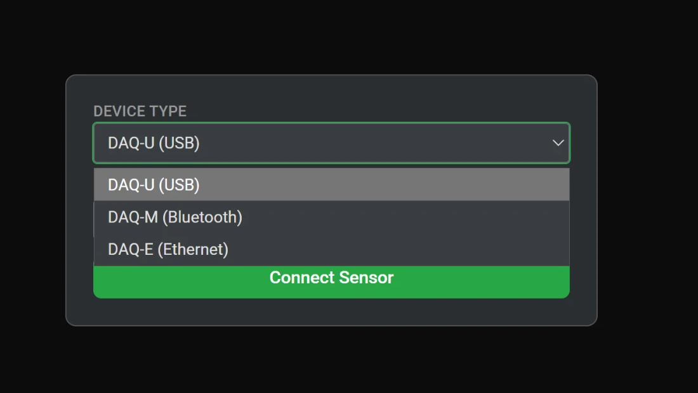

# Skirtukas „DAQ“ Chloros

Skirtukas „DAQ“ — Chloros šoninėje juostoje pažymėtas kaip **Šviesos jutikliai** — yra [DAQ-U, DAQ-M ir DAQ-E šviesos jutiklių](README.md) valdymo sąsaja realiuoju laiku: prijunkite jutiklius per bet kurį duomenų perdavimo kanalą, stebėkite kalibruotus spektrus realiuoju laiku, apskaičiuokite atspindžio koeficientą iš jutiklių poros ir įrašykite `.daq` failus tiesiai į savo projektą.

Šis skirtukas tampa prieinamas, kai baigiasi Chloros užkulisio paleidimas. Skirtuko diagramos atnaujinamos per „Chloros“ DAQ paslaugą, naudojant tiesioginį ryšį, kuris, jei nutrūksta, automatiškai atsinaujina (2–10 s pertrauka); kol paslauga nepasiekiama, jutiklio būsenos eilutėje rodomas tekstas **„No Server“**.

Išdėstymas susideda iš **jutiklių šoninės juostos**(po vieną eilutę kiekvienam prijungtam jutikliui) ir**diagramų srities** (po vieną diagramos langelį kiekvienam jutikliui ar grupei).

<!-- SCREENSHOT-NEEDED: full DAQ (Light Sensors) tab in list view with one DAQ-E connected — sensor sidebar on the left (Connect Sensor + Record All buttons, one sensor row), spectrum chart with rainbow fill in the main area, live data table below the chart -->

***

## Jutiklio prijungimas

Spustelėkite **Prijungti jutiklį** šoninės juostos viršuje. Prijungimo dialogo langas atsidaro pagrindinėje srityje (arba kaip užklotas, jei pridedamas kitas jutiklis — tokiu atveju pasirodo mygtukas „Atšaukti“).

| Valdymas | Elgsena |
| --- | --- |
| **Įrenginio tipas** | `DAQ-U (USB)` (numatyta reikšmė), `DAQ-M (Bluetooth)` arba `DAQ-E (Ethernet)`. Pakeitus tipą, vėl pradedamas naujai pasirinktos perdavimo rūšies nuskaitymas. |
| **Prievadas / BLE įrenginys / Prieglobos vardas / IP** | Rodo aptiktus įrenginius kaip „`device - description`“; automatiškai pasirenkamas pirmasis įrašas, atpažintas kaip jutiklis. Skenavimo metu rodomas `Scanning...` (USB), `Scanning (N)...` su 8 sekundžių atgaline skaičiavimo juosta (BLE) arba `Discovering ethernet sensors (N)...` su 5 sekundžių atgaline skaičiavimo juosta (Ethernet). Tušti rezultatai rodomi kaip „`No ports`“ / „`No BLE devices`“ / „`No ethernet sensors found`“. |
| **↻ Atnaujinti** | Nedelsiant pakartotinai nuskaito pasirinktą perdavimo būdą (neveikia BLE/Ethernet nuskaitymo metu). |
| **Prisijungti** | Įjungiama, kai pasirenkamas įrenginys; prisijungimo metu pavadinimas pakeičiamas į `Connecting...`. |

Paieška vyksta tik **kol ekrane rodomas prisijungimo dialogas** ir kartojasi kas 15 sekundžių tik pasirinktam perdavimo būdui — vien tik atidarius skirtuką nuskaitymas nevyksta. Jei nepavyksta prisijungti, dialoge rodomas pranešimas: *„Prisijungti nepavyko. Pabandykite atjungti ir vėl prijungti jutiklį, tada vėl spustelėkite „Prisijungti“.“*

Šoninė juosta atsidaro automatiškai, kai prisijungia pirmasis jutiklis.


**„DAQ-E“ nerodomas?** „DAQ-E“ neturi būsenos šviesos diodo — patikrinkite PoE/ryšio indikatorių ant komutatoriaus arba įterpimo prievado, prie kurio jis prijungtas, ir po įjungimo palaukite keletą sekundžių, kol jis įsikraus. Chloros įrenginys turi būti tame pačiame transliacijos domene (mDNS neperžengia maršrutizatorių). Windows įrenginyje pirmą kartą, kai Chloros susieja savo daugiaadresinius lizdus (mDNS UDP 5353, DAQ-E duomenys UDP 5002, PTP UDP 319/320). Du DAQ-E įrenginiai viename LAN tinkle aptinkami atskirai, kiekvienas su savo „`daq-e-<id>.local`“ kompiuterio vardu.


<figure><figcaption>Įrenginio tipas siūlo DAQ-U (USB), DAQ-M (Bluetooth) ir DAQ-E (Ethernet)</figcaption></figure>***

## Jutiklių šoninė juosta

Kiekvienam prijungtam jutikliui skiriama viena eilutė (plius viena eilutė kiekvienai „Ambient+Object“ grupei). Eilutes galima perkelti ir pertvarkyti, o jų tvarka taip pat keičia diagramų plytelių išdėstymą. Spustelėkite eilutę, kad tas jutiklis ar grupė taptų aktyvia diagrama sąrašo peržiūroje.

| Elementas | Reikšmė |
| --- | --- |
| Spalvota kairioji riba | Jutiklio diagramos spalva. |
| Transporto žymė | `DAQ-U` / `DAQ-M` / `DAQ-E` arba žalia žymė `REF`, skirta „Ambient+Object“ atspindžio grupei. |
| Įrenginio pavadinimas | Numatytasis pavadinimas – jutiklio serijos numeris (jo pastovus identifikatorius kalibravimui, `.daq` failų pavadinimams ir importo atitikčiai); pasirinktiniai pavadinimai išlieka kiekviename projekte. |
| **Kalibruota** piktograma (žalia) | Rodoma, kai įkeltas gamintojo kalibravimo rinkinys, t. y. spektrai yra tikslūs W/m²/nm. |
| **Galimas atnaujinimas** piktograma (gintarinė, tik DAQ-E) | Veikianti programinė įranga yra senesnė nei vaizdas, pridedamas prie šios „Chloros“ versijos. Atnaujinimo metu rodo realaus laiko pažangą (`Flashing… N%`, `Restarting sensor…`, tada `Updated X → Y` arba `Failed`). |
| Akis | Įjungia arba išjungia šio jutiklio matomumą diagramoje. |
| Ratukas | Atidaro atskirų jutiklių nustatymų langą (žr. žemiau). |
| ✕ (raudonas) | Atjungia jutiklį arba pašalina „Ambient+Object“ grupę. |

Virš eilučių yra du mygtukai:

* **Prijungti jutiklį** — atidaro prijungimo dialogą (kol vyksta prijungimas, pavadinimas pakeičiamas į „`Connecting...`“).
* **Įrašyti viską / Sustabdyti viską**— pradeda arba sustabdo `.daq` įrašymą**kiekviename**prijungtame jutiklyje. Reikia bent vieno jutiklio**ir atidaryto projekto** (patarimas: „Atidarykite projektą, kad galėtumėte įrašyti“); kol vyksta įrašymas, mygtukas tampa raudonas.

Tuščioje būsenoje rodomas užrašas „Jokie jutikliai neprijungti“.

<!-- SCREENSHOT-NEEDED: sensor sidebar with three rows — a DAQ-E showing both the green Calibrated pill and the amber Update Available pill, a DAQ-U row, and a green REF group row — plus the Connect Sensor and Record All buttons -->

***

## Nustatymai pagal jutiklį (dantukų piktogramos langas)

Atidarykite paspaudę dantukų piktogramą jutiklio eilutėje. Turinys eilės tvarka:

* **Informacinės eilutės** — Įrenginio tipas (DAQ-U/M/E), Ryšys (`Serial (USB)` / `Bluetooth` / `Ethernet`), prievadas (COM prievadas, BLE adresas arba pagrindinis kompiuteris) ir serijinis numeris.
* **Kalibravimo ataskaita: atsisiųsti** — atsisiunčia šio įrenginio NIST atsekamą kalibravimo sertifikatą (PDF) ir atidaro jį jūsų PDF peržiūroje. Prieinama, kai žinomas serijinis numeris; sertifikatas įrašomas į talpyklą pirmojo prisijungimo metu.
* **Įrenginio pavadinimas** — spustelėkite pieštuką, kad pakeistumėte pavadinimą; išlieka kiekvienam projektui.
* **Grafikos linijos spalva** — spalvų paletė; išlieka kiekvienam projektui.
* **Integracijos laikas (ms)**— slankiklis + skaičius,**1–500 ms**, numatytasis**32 ms**. Išjungta, kai AE yra įjungta.
* **Kadrų vidurkis**— slankiklis + skaičius,**1–50 kadrų**, numatytasis**20**.
* **AE: ĮJUNGTA/IŠJUNGTA**— automatinės ekspozicijos perjungimas; prisijungus**numatyta ĮJUNGTA**. Išjunkite, jei norite integracijos laiką nustatyti rankiniu būdu.
* **Sustabdyti transliaciją / Pradėti transliaciją** — sustabdykite arba atnaujinkite tiesioginę transliaciją.
* **Įrašyti / Sustabdyti įrašymą** — įrašymas pagal kiekvieną jutiklį `.daq` (reikia atidaryto projekto).
* **Cap** — „Cap“ korekcijos profilis (kitas skyrius).
* **Tiesioginės informacijos eilutės** — integracijos laikas (ms), kadrų dažnis (FPS), mėginiai, įrašymas (raudona `REC` arba `Off`) ir būsena (`Streaming` / `Paused` / `SATURATED` / `No Server`).

### Tik „DAQ-E“: tinklo, programinės įrangos ir PTP eilutės

* **Pagrindinio kompiuterio vardas / IP** — dabartinis įrenginio adresas.
* **Programinė įranga** — dabartinė programinės įrangos versija ir veiksmų langelis:<version\>

mygtukas</version\>

**Atnaujinti į \<version\>** pasirodo</version\>

,<version\>

kai ši Chloros versija apima naujesnį DAQ-E programinės įrangos atvaizdą. Atnaujinimas per tinklą įdiegiama per maždaug 30 sekundžių; jutiklis automatiškai paleidžiamas iš naujo ir vėl prisijungia, o nutrauktas perdavimas nepakeičia esamos programinės įrangos. Atnaujinimo eiga rodomi realiuoju laiku (`Flashing… N%` → `Restarting sensor…` → `Updated X → Y`), o langelyje rodomas `Up to date`, kai atnaujinimas vyksta.
* **PTP sinchronizavimas** — dabartinė PTP būsena (grįžta prie `unknown`). DAQ-E programinė įranga v1.2.0+ dalyvauja IEEE 1588 PTPv2 kaip tik pavaldusis laikrodis; Chloros pagrindinio kompiuterio užkulisiai yra PTP „grandmaster“, o kiekviena DAQ-E ir „LATTICE“ kamera vietiniame tinkle (LAN) veikia kaip jo pavaldiniai 0 domeno ribose, išlaikydamos laiko žymes su maždaug 1 ms nuokrypiu.

„Ambient+Object“ grupės atveju įrangos modaliniame lange rodomi tik grupės šaltinio jutikliai, įrenginio pavadinimas ir grafiko linijos spalva.

<!-- SCREENSHOT-NEEDED: per-sensor settings modal for a DAQ-E — info rows, Calibration Report Download, Hostname/IP + Firmware row with an "Update to <ver>" button, PTP Sync row, Integration Time / Frame Average sliders, AE ON toggle, and the Cap dropdown all visible (scrolled composite acceptable) -->

### Dangtelio pasirinkimas

Išskleidžiamajame meniu **„Cap“** nurodoma, koks fizinis dangtelis yra uždėtas ant jutiklio difuzoriaus, ir kiekvienam spektrui taikomas to dangtelio gamyklos išmatuotas korekcijos profilis. Pasirinkimai priklauso nuo modelio:

| Modelis | Dangtelių pasirinkimai |
| --- | --- |
| DAQ-U | Nėra (atviras jutiklis), FOV 15°, FOV 30°, FOV 45°, FOV 60°, FOV 90°, „Sunshine“ (kosinusinis korektorius) |
| DAQ-M | Nėra (atviras jutiklis), „Sunshine“ (kosinusinis korektorius) |
| DAQ-E | Nėra (atviras jutiklis), FOV 15°, FOV 45°, FOV 90°, „Sunshine“ (kosinusinis korektorius) |

**Kiekvieno modelio numatytasis nustatymas yra „Sunshine“ (kosinuso korektorius)** — „MAPIR“ kiekvieną DAQ siunčia su uždėtu „Sunshine“ dangteliu, ir tai yra standartinė konfigūracija lauke: 180° pusrutulio matymo kampas su kosinusine paklaida ≤ ±4 % iki 60° ir ≤ ±4,5 % iki 70° (nerekomenduojama, kai saulės aukštis mažesnis nei ~15°), silpninantis pagal konstrukciją (~12×). Jūsų pasirinkimas išlieka projekte.


**Dangtelio pasirinkimas turi atitikti fiziškai uždėtą dangtelį.**Nei jutiklis, nei programinė įranga negali nustatyti, koks dangtelis yra uždėtas. Pasirinkimas lemia tiek realaus laiko korekciją, tiek žymą, įrašomą į kiekvieną `.daq` failą — dėl „Sunshine“ dangtelio ~12× silpninimo, nedeklaruotas dangtelio pakeitimas spektrus neteisingai koreguoja maždaug tuo pačiu koeficientu. (Nuimant ir vėl uždedant tą patį dangtelį, paklaida siekia apie 1,5 %.) Pasirinkite**„None“ (neuždengtas jutiklis)** tik tada, kai dangtelis fiziškai nuimtas; DAQ-E atveju pasirinkus „None“ vis tiek taikomas gamyklinis geometrijos profilis įdubusiam stikliniam difuzoriui – tai nėra neveikianti operacija – o neuždengtas DAQ-E yra laboratorinė konfigūracija, o ne palaikoma lauko konfigūracija.



Atnaujinimas iš ankstesnės versijos: naršyklės pusėje esantis 1.1.0 versijos perjungiklis „Sunshine Diffuser Installed“ (Įdiegtas „Sunshine“ difuzorius) buvo pašalintas. Dabar dangtelio tvarkymas vykdomas pagal kiekvieno jutiklio dangtelio profilį, taikomą serverio pusėje.


***

## Diagramų sritis

Prisegtoje viršutinėje juostoje yra **perjungiklis „sąrašas ⇄ tinklelis“**ir**diagramos mastelio keitimo** slankiklis (plytelių dydis 200–2000 pikselių). Rodinys automatiškai persijungia į tinklelio režimą, kai yra daugiau nei viena diagramų grupė, o kai jų yra viena ar mažiau – grįžta į sąrašo režimą. Rodinio režimas ir diagramos dydis išlieka tokie patys kiekvienam projektui.

Kiekvieno jutiklio **spektro diagrama** rodo:

* **X ašis** — bangos ilgis (nm). Jutiklio tinklelis yra 340–1010 nm kas 5 nm (135 taškai), interpoliuotas iki 1 nm rodymui.
* **Y ašis** — galia (W/m²), su automatiniu SI priešdėliu (m/µ/n), parinktu pagal didžiausią vertę. Spektrai visose trijose perdavimo sistemose yra radiometriškai kalibruotas spektrinis spinduliavimo intensyvumas (W/m²/nm).
* Vienos kreivės apačioje rodomas vaivorykštinis spektrinis užpildymas; keli jutikliai viename grafike perkloti kaip spalvotos linijos su prislopintu užpildymu.
* **Pele užvedus**— vertikalus žymeklis su bangos ilgiu ir kiekvieno jutiklio verte;**patempkite**, kad priartintumėte (priartinus pasirodo sumažinimo mygtukas).
* Mygtukas **+** (tik tinklelinio vaizdo režime) skirtas jutikliui pridėti prie šio grafiko arba sukurti grupę (žr. žemiau).
* Įrenginio pavadinimas išcentruotas viršuje, o kol gaunamas pirmasis kadras, rodomas sukamas ratukas.

**Prisotinimas** pačiame grafike nepažymėtas: prisotintas jutiklis rodo raudoną `SATURATED` būsenos tekstą ir raudoną `Saturated: Yes` eilutę tiesioginių duomenų lentelėje. Norėdami išvalyti, sumažinkite integravimo laiką arba vėl įjunkite AE.

<!-- SCREENSHOT-NEEDED: grid view with at least two chart tiles visible, the Chart Zoom slider and list/grid toggle in the top bar, and the "+" add-sensor button visible on one tile -->

***

## Tiesioginių duomenų lentelė (sąrašo peržiūra)

Po diagramos sąrašo peržiūroje, atnaujinama kas 500 ms:

* **Visi modeliai**: Šviesos spalvos pavyzdys (sRGB pagal CIE XYZ), Prisotintas (Taip/Ne), CIE 1931 X/Y/Z, Chromatinumas x/y, CIE u′/v′, CCT (K), CRI (Ra), Dominuojantis bangos ilgis (nm), didžiausias bangos ilgis (nm), sužadinimo grynumas, Duv, CIE L\*/a\*/b\* ir Munsell H/V/C.
* **Tik kalibruoti jutikliai**(bet kuris iš DAQ-U / DAQ-M / DAQ-E, kai įkeltas gamyklinis kalibravimo rinkinys — tai rodo žalia žymė**Kalibruotas** jutiklio eilutėje): Bendra galia (W/m²), fotopinis liuksas (lx), skotopinis liuksas (lx), S/P santykis, PPFD ir PPFD Red/Green/Blue (µmol/m²/s) bei opiniai spinduliavimo stiprumai — S-konų, melanopinis, rodopinis, M-konų, L-konų (visi W/m²).

<!-- SCREENSHOT-NEEDED: list view live data table for a DAQ-E showing both the colorimetric rows and the power-calibrated rows (Total Power, Photopic/Scotopic Lux, PPFD, opic irradiances) -->

***

## Atspindžio grupės (Aplinkos + Objekto)

Du sujungti jutikliai gali būti sujungti į atspindžio rodymo ekraną realiuoju laiku — be kameros:

1. Tinklelio peržiūroje spustelėkite **+**ant diagramos plytelių ir pasirinkite**Sujungti aplinką + objektą**.
2. Pasirinkite **Aplinkos šviesos šaltinio**jutiklį ir**Objekto skaitytuvo**jutiklį (du skirtingus jutiklius), tada spustelėkite**Sukurti**.

Chloros apskaičiuoja R(λ) = objektas(λ) / aplinka(λ) kiekvienam bangos ilgiui iš dviejų tiesioginių srautų (0, kai aplinka ≤ 0). Grupės pavadinimas priklauso nuo jutiklių kalibravimo klasės:

* Abu jutikliai kalibruoti (įkeltas rinkinys) → **„Matomasis atspindžio koeficientas“**.
* Vienas iš jutiklių nekalibruotas → **„Santykinis atspindžio koeficientas“**.

Grupė šoninėje juostoje rodoma kaip žalia `REF` eilutė ir turi savo diagramą (vaivorykštinis užpildymas, verčių rodymas iki 4 skaičių po kablelio, mastelio keitimas vilkdami).

Meniu **+**taip pat siūlo parinktį**Pridėti naują jutiklį** su trimis išdėstymo variantais: *Sujungti naują jutiklį* (pridėti prie šio diagramos), *Perkelti esamą jutiklį čia* arba *Peržiūrėti naują jutiklį* (atskiras diagramos langas).

<!-- SCREENSHOT-NEEDED: the "+" add-sensor overlay open on a chart tile showing the menu (Add New Sensor / Combine Ambient + Object / Cancel), and the Ambient + Object sub-dialog with its two sensor selects -->

### Augmenijos indekso lentelė

Sąrašo peržiūroje po atspindžio grupės diagramos pateikiama augmenijos indekso lentelė, apskaičiuota remiantis realiuoju atspindžiu juostų centruose **mėlyna 450 / žalia 550 / raudona 670 / NIR 800 nm** (reikšmės su 4 skaičiais po kablelio, `---`, kai neįmanoma apskaičiuoti; užveskite pelę ant indekso pavadinimo, kad pamatytumėte jo pilną pavadinimą):

* **Visada rodomi** (nepriklausomi nuo masto, bet kokia jutiklių kombinacija): NDVI, GNDVI, ENDVI, WDRVI, GRVI, CVI, GCI, MSR.
* **Tik tada, kai abu jutikliai yra kalibruoti pagal galią** (įkelti abu rinkiniai): EVI, SAVI, OSAVI, GSAVI, GOSAVI, MSAVI2, RDVI, TDVI, LAI, NLI, MNLI, FCI, GEMI

<!-- SCREENSHOT-NEEDED: an Ambient+Object reflectance group in list view — reflectance chart labeled "Apparent Reflectance" with the vegetation index table below it showing live NDVI etc. -->

.***

## `.daq` failų įrašymas

* Įrašymui reikalingas **atviras projektas** — priešingu atveju tiek mygtukas „Įrašyti viską“ (šoninėje juostoje), tiek atskirų jutiklių įrašymo mygtukai yra išjungti.
* Failai įrašomi į **`<project folder>/light_sensor/`**; failų pavadinimuose nurodomas jutiklio ID ir laiko žyma, o įrašymo metu išsaugomas įrenginio pavadinimas.
* Kai įrašymas sustabdomas („Stop“, „Stop All“, arba nutraukus ryšį įrašymo metu), užbaigtas `.daq` failas **automatiškai pridedamas prie atviro projekto** — jis atsiranda projekto failų sąraše be jokio rankinio pridėjimo, paruoštas naudoti kaip žemyn nukreipti duomenys [atspindžio apdorojimui](README.md).
* Įrašymo metu nustatymų lango tiesioginėse eilutėse rodomas raudonas `REC` indikatorius.

Norint gauti kiekybinius spinduliavimo stiprio skaičius, reikia apskaičiuoti bent 15 sekundžių duomenų vidurkį — tai prietaiso charakteristika, o ne gedimas.

<!-- SCREENSHOT-NEEDED: recording in progress — sidebar Stop All button in its red state and the settings modal live rows showing Recording: REC -->

***

## Daugialypės jutiklių išdėstymo schemos ir projekto išsaugojimas

* Viename grafike sujunkite kelis jutiklius (bendros ašys), išlaikykite atskirus grafikus (automatinis tinklelio išdėstymas), perkelkite jutiklius iš vieno grafiko į kitą, vilkite ir keiskite eilučių/plytelių tvarką bei paslėpkite atskirus jutiklius naudodami akies piktogramą.
* Kiekvienam projektui išsaugomi šie Chloros parametrai: prietaisų pavadinimai, grafikų spalvos, diagramos dydis, peržiūros režimas ir kiekvieno jutiklio nustatymai (integravimo laikas, kadrų vidurkavimas, AE būsena, ribos pasirinkimas).
* **Vėl atidarius projektą, jo jutikliai automatiškai vėl prisijungia** pagal adresą — COM prievadą „DAQ-U“ atveju, BLE įrenginį „DAQ-M“ atveju, mDNS vardas DAQ-E atveju (nustatomas net ir pasikeitus įrenginio IP adresui) — ir iš naujo pritaiko kiekvieno jutiklio išsaugotą ribos profilį, kadrų vidurkavimą, AE būseną ir rankinį integracijos laiką.***

## Kameros suporavimas (DLS)

Nereikia nieko suporuoti. Skirtingai nuo dronų DLS darbo eigos, kurioje šviesos jutiklis su kamera susiejamas iš anksto, „Chloros“ suderina DAQ duomenis su vaizdais vėlesniame etape: importavimo / apdorojimo metu „`.daq`“ rodmenys interpoliuojami pagal kiekvieno kadro ekspozicijos laiko žymą. Įrašykite naudodami bet kurį prijungtą jutiklį (`.daq` automatiškai patenka į projektą), o atspindžio apdorojimas pagal laiką suranda reikiamus rodmenis — kaip naudojami žemyn nukreipti duomenys, žr. [DAQ šviesos jutikliai](README.md).</version\>
