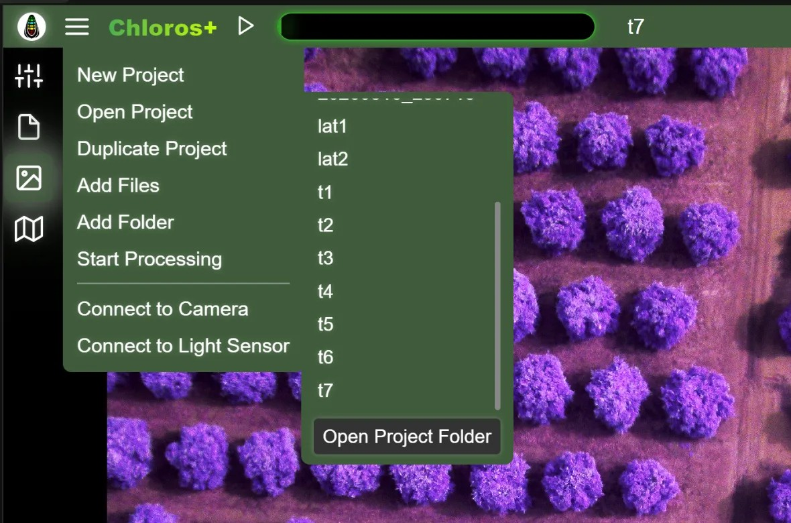

# Grafinė vartotojo sąsaja: Projektai

Chloros leidžia kurti projektus, kuriuos ateityje galima vėl atidaryti. Projektas yra paprastas aplankas (esantis jūsų projektų aplanke), kuriame yra:

* `project.json` — projekto nustatymus, failų sąrašą ir rodymo parametrus
* `cameras.json` — projekto veikimo metu prijungtas kameras ir jutiklių masyvus su jų nustatymais
* `sensors.json` — DAQ šviesos jutikliai, prijungti, kol projektas buvo atidarytas, bei kamerų ir jutiklių susiejimai
* jūsų užfiksuoti vaizdai, `.daq` įrašai ir apdorotų rezultatų aplankai

Nėra jokio patentuoto projekto failo formato — aplankas ir jame esantys JSON failai sudaro projektą, todėl projektus lengva kopijuoti, archyvuoti ir perkelti iš [CLI](CLI.md) arba [Python SDK](api-python-sdk.md).

## Naujas projektas

<figure><figcaption></figcaption></figure>Pagrindiniame meniu pasirinkite „Naujas projektas“ ir įveskite unikalų savo projekto pavadinimą.

Jei esate išsaugoję kokius nors projekto šablonus, po pavadinimo laukeliu atsiras išskleidžiamasis meniu **Pasirinkti šabloną** — pasirinkus vieną iš jų, naujas projektas bus pradėtas pagal to šablono nustatymus. Šablonai išsaugomi per [Projekto nustatymus](project-settings/project-settings.md): įveskite pavadinimą laukelyje „Išsaugoti projekto šablono pavadinimą“ ir spustelėkite išsaugojimo piktogramą.

## Atidaryti projektą

<figure><figcaption>
Skiltyje „Atidaryti projektą“ pateikiamas visų jūsų projektų aplanke esančių projektų sąrašas, o apačioje – nuoroda <strong>„Atidaryti projektų aplanką“</strong>
</figcaption></figure>Pasirinkite „Atidaryti projektą“, kad pamatytumėte esamų projektų sąrašą projekto aplanke. Jei projektų nėra, antrinis šoninis meniu neatsivers. Pirmiau pateiktoje nuotraukoje matyti keletas GUI sukurtų projektų (t1, t2, t3). Projektai „DATE\_TIME“ buvo sukurti naudojant CLI pagal numatytąją projektų pavadinimų schemą. Spustelėjus bet kurio projekto pavadinimą, jis bus atidarytas.

Spustelėjus mygtuką „Atidaryti projekto aplanką“ atsidarys jūsų kompiuterio failų naršyklė, nukreipta į projekto kelią. Projekto kelią galite pakeisti [Projekto nustatymuose](project-settings/project-settings.md).

Jei nuo paskutinio projekto atidarymo buvo perkelti arba ištrinti kokie nors projekto šaltinio vaizdo failai, „Chloros“ rodo dialogo langą, kuriame tiksliai nurodoma, kokių failų trūksta, o ne atidaro tuščią tinklelį.

## Projekto kopijavimas

Ši funkcija prieinama, kai projektas yra atidarytas. Pasirinkite „Duplikuoti projektą“, kad nukopijuotumėte esamą projektą su nauju pavadinimu — Chloros pasiūlys kitą laisvą pavadinimą (pvz., „ManoProjektas (2)“) — ir kopija bus atidaryta iš karto.

## Pridėti failus

Atidarius projektą, pagrindiniame meniu pasirinkite „Pridėti failus“, kad į dabartinį projektą pridėtumėte atskirus vaizdo failus. Ši funkcija atitinka failų naršyklės pridėjimo funkciją, tačiau patogumo dėlei ji prieinama tiesiogiai iš pagrindinio meniu.

## Pridėti aplanką

Atidarius projektą, pagrindiniame meniu pasirinkite „Pridėti aplanką“, kad į esamą projektą pridėtumėte vaizdų aplankus. Vienu kartu galite pasirinkti kelis aplankus. Duplikatai ignoruojami.

## Pradėti / Sustabdyti apdorojimą

Pridėjus failus į projektą, pagrindiniame meniu tampa prieinama parinktis „Pradėti apdorojimą“. Tai tas pats veiksmas, kaip ir paspaudimas mygtuko „Paleisti/Pradėti“ viršutiniame antrašte. Apdorojimo metu meniu punktas pasikeičia į „Sustabdyti apdorojimą“, kad galėtumėte sustabdyti apdorojimo procesą.

## Prijungti prie kameros / Prijungti prie šviesos jutiklio

Pagrindinio meniu apačioje yra du aparatinės įrangos sparčiosios nuorodos, prieinamos tiek atidarius projektą, tiek jo neatidarius:

* **Prijungti prie kameros** — atidaro [skirtuką „Kameros“](lattice/), skirtą prijungti „LATTICE“ kamerą arba kamerų masyvą.
* **Prisijungti prie šviesos jutiklio** — atidaro [„Šviesos jutikliai“ skirtuką](daq/), skirtą prijungti DAQ šviesos jutiklį.

Prijungus įrangą, kai projektas yra atidarytas, ji išsaugoma projekte (žr. toliau). Jei projektas neatidarytas, jungtys galioja tik sesijos metu.


Meniu punktai „Pridėti failus“, „Pridėti aplanką“ ir „Pradėti / Sustabdyti apdorojimą“ matomi arba įjungti tik tada, kai projektas atidarytas ir failai jau pridėti. Jie suteikia greitą prieigą prie veiksmų, kurie taip pat prieinami per failų naršyklės šoninę juostą ir antraštės mygtukus.


## Projektai įsimena jūsų įrangą

Nauja 1.2.0 versijoje: projektas išsaugo įrangą, kurią prijungiate, kol jis yra atidarytas. Kameros ir matricos (kartu su kiekvienos kameros nustatymais, pavadinimais, spalvomis ir tinklelio išdėstymu) yra įrašomos į „`cameras.json`“, o šviesos jutikliai (kartu su pavadinimais, spalvomis ir kamerų susiejimais) – į „`sensors.json`“ — automatiškai, jums dirbant.

Kai **vėl atidarote** projektą, „Chloros“ iš karto nesusijungia su jokia įranga. Kiekviena pusė vėl prisijungia, kai pirmą kartą atidarote jai priklausančią kortelę:

* Atidarius skirtuką **„Kameros“**, iš naujo prijungiamos išsaugotos kameros ir matricos bei iš naujo pritaikomi jų išsaugoti nustatymai.
* Atidarius skirtuką **Šviesos jutikliai**, iš naujo prijungiami išsaugoti DAQ jutikliai.

Tokiu būdu, atidarius projektą tik tam, kad peržiūrėtumėte ar eksportuotumėte vaizdus, kameros niekada nebus įjungtos transliacijai. Jei atidarius skirtuką nepavyksta rasti išsaugoto įrenginio, dialogo lange bus nurodyta, kurie įrenginiai yra neprieinami, kad galėtumėte juos iš naujo prijungti arba pašalinti.

## DAQ įrašai ir .daq failai projekte

* `.daq` įrašai, padaryti, kai projektas yra atidarytas (iš skirtuko „Šviesos jutikliai“ arba fiksavimo metu), **automatiškai pridedami prie projekto**.
* Importuoti `.daq` failai ir visi projekto įrašai yra išvardyti [Projekto nustatymų](project-settings/project-settings.md) skyriuje **„DAQ šviesos jutiklis“**, kiekvienas su savo apšvietimo korekcijos profiliu.
* Apdorojimo metu projekto `.daq` failai teikia žemyn nukreiptą apšvietimą atspindžio produktams — žr. [Išvesties vaizdo formatai](output-image-formats.md).

## Išsaugoto projekto vykdymas be grafinės sąsajos

Išsaugotą projektą galima vykdyti be grafinės vartotojo sąsajos (GUI):

* **CLI**: „`chloros-cli project open / connect / capture / sensor / align / run`“ veikia pagal projekto aplanko kelią — žr. [„CLI“ nuorodą](reference/cli-reference.md).
* **SDK**: `chloros_sdk.open_project(path)` grąžina projekto identifikatorių; `connect_all()` įjungia visas išsaugotas kameras ir jutiklius su jų išsaugotais nustatymais — žr. [SDK nuorodą](reference/sdk-reference.md).
